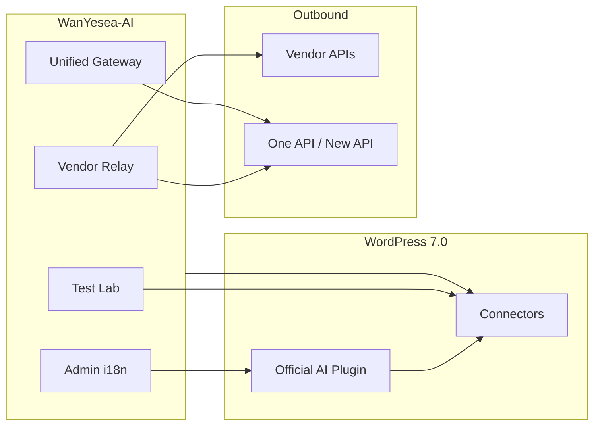

# WanYesea-AI

[](https://wordpress.org/)
[](https://www.php.net/)
[](https://github.com/li1023qwq/WanYesea-AI/releases)
[](https://github.com/WordPress/ai)
[](https://github.com/li1023qwq/WanYesea-AI/actions)

**[ 简体中文 ](./README.md)**


**WanYesea-AI** extends the [WordPress 7.0 AI stack](https://github.com/WordPress/ai) with a Zibll-theme admin panel for AI connectivity, API relay, and unified gateway management. Configure vendor API keys and relay base URLs in one place—they sync to **Connectors** automatically. Register One API / New API endpoints as first-class providers for text, vision, and image-generation experiments.

## Features

- Centralized API keys and relay base URLs; rewrites official outbound URLs when relay is enabled.
- OpenAI text uses `chat/completions` for compatibility with One API / New API gateways.
- Environment variables / `wp-config` constants take precedence (`WANYESEA_AI_*_API_KEY`).
- **Unified AI Gateway**: multiple relays as `wanyesea-gateway-*` providers; OpenAI Compatible and Anthropic Messages.
- Local model pool, `/models` fetch, capability tags (text / vision / image).
- Image flow: `chat/completions` first, `images/generations` fallback.
- Built-in text / image test lab and environment probes.
- Runtime zh_CN overlay for the official `ai` plugin (707 strings, DOM mutation observer).
- GitHub Releases auto-update ([li1023qwq/WanYesea-AI](https://github.com/li1023qwq/WanYesea-AI)).

## Screenshots


## Requirements

| Item | Minimum |
|------|---------|
| WordPress | 7.0+ |
| PHP | 7.4+ |
| Theme | Zibll (CSF framework required) |
| Dependency | Official [WordPress AI plugin](https://github.com/WordPress/ai) |

## Usage

### 1. Install

Install and activate the **WordPress AI plugin** and **WanYesea-AI**.

### 2. AI Connect

Open **WanYesea-AI → AI Connect** in the Zibll admin:

- Verify environment checks are green;
- Enable **API relay**;
- Set **API Key** and **relay Base URL** for each vendor, then save.

### 3. Enable experiments

In WordPress **Settings → AI**, enable the experiments you need.

### 4. Unified gateway (optional)

Under **Unified AI Gateway**, add One API / New API sites, fetch models, and tag capabilities.

### 5. Interface i18n (optional)

Under **Interface i18n**, enable the zh_CN overlay for the AI admin UI.

## Admin sections

| Section | Description |
|---------|-------------|
| Getting Started | Environment notes and workflow |
| AI Connect | Vendor relay, keys, Connectors sync |
| Unified AI Gateway | Multi-gateway providers and model pools |
| Interface i18n | zh_CN overlay toggle |
| AI Test Lab | Text / image tests |
| Backup & Import | Export / restore settings |
| Changelog | Version history and GitHub updates |

## Architecture



## Environment variables (optional)

In `wp-config.php`; they **override** stored options:

```php
define('WANYESEA_AI_OPENAI_API_KEY', 'sk-...');
define('WANYESEA_AI_GITHUB_TOKEN', 'ghp_...'); // optional
```

Pattern: `WANYESEA_AI_{PROVIDER}_API_KEY` (uppercase provider ID with underscores).

## Release workflow

```bash
git add .
git commit -m "v1.2.4: AI post draft and AI comment reply"
git push
git tag v1.2.4
git push origin v1.2.4
```

Pushing a `v*` tag triggers GitHub Actions to build the Release. Sites update from **Plugins → Updates**.

Local zip (optional):

```powershell
.\scripts\build-release.ps1
```

## FAQ

<details>
<summary><strong>Settings page missing or unstyled?</strong></summary>

Requires the **Zibll theme** and its CSF options framework.
</details>

<details>
<summary><strong>Relay lists models but tests fail with "No models found"?</strong></summary>

With relay enabled, tests use the HTTP `/models` list. Verify the base URL and exact model IDs from your gateway.
</details>

<details>
<summary><strong>No GitHub Release yet?</strong></summary>

Push code and tag: `git tag vX.Y.Z && git push origin vX.Y.Z`. Actions uploads `WanYesea-AI.zip` automatically.
</details>

## Links

- Repository: [github.com/li1023qwq/WanYesea-AI](https://github.com/li1023qwq/WanYesea-AI)
- Author: [li1023.com](https://li1023.com/)
- WordPress AI: [github.com/WordPress/ai](https://github.com/WordPress/ai)
- Zibll theme: [zibll.com](https://www.zibll.com/)

---

<sub>Copyright © WanYesea · <a href="https://li1023.com/">li1023.com</a> · <a href="./README.md">简体中文</a></sub>
